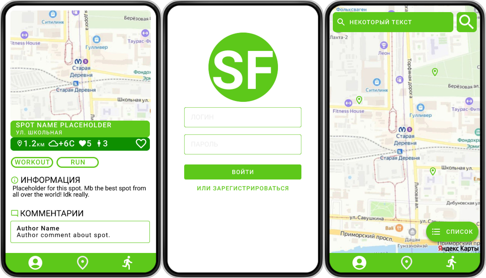

# Sportfinder Backend
Backend часть мобильного приложения Sportfinder.  
**Sportfinder** - платформа, распространяющая данные об уличных спортивных площадках, пользовательских маршрутах и тренировках.

### Функционал приложения:  
✔ Поддержка регистрации и авторизации пользователей  
✔ Сбор информации о площадках с помощью муниципального API  
✔ Получение погоды на площадке с помощью YandexAPI  
✔ Сохранение пользовательских беговых маршрутов   
✕ Сохранение пользовательских оценок и комментериев  
✕ Настройки пользователя  
✕ Отображение информации в профиль пользователя  
### Стек:
* Python
* Flask
* PostgreSQL  

Временный host: [Vercel](https://sportfinder-backend.vercel.app/) (запросы на YandexAPI и муниципальное API не проходят, для этого используются моковые данные).

